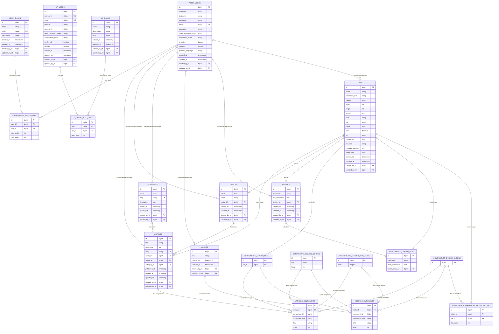

# Diagrama da Estrutura do Banco de Dados - Apostolado Cardeal Newman

## Diagrama de Entidade-Relacionamento (ERD)

## Resumo da Estrutura

### Entidades Principais do Conteúdo

1. **ARTICLES** (Artigos)

   - Entidade principal para posts do blog
   - Relaciona com Author (muitos para um)
   - Relaciona com Category (muitos para um)
   - Tem imagem de capa (cover)
   - Suporta draft/publish
   - Contém blocos dinâmicos (dynamic zone)

2. **AUTHORS** (Autores)

   - Informações dos autores dos artigos
   - Pode ter avatar
   - Relacionamento um-para-muitos com articles

3. **CATEGORIES** (Categorias)

   - Organização dos artigos por categoria
   - Relacionamento um-para-muitos com articles

4. **ABOUTS** (Sobre)

   - Página única sobre o site/organização
   - Contém blocos dinâmicos (dynamic zone)

5. **GLOBALS** (Configurações Globais)
   - Configurações gerais do site
   - Nome do site, descrição, favicon
   - SEO padrão

### Componentes Dinâmicos (Dynamic Zones)

Os artigos e a página "sobre" utilizam dynamic zones que permitem combinações flexíveis de:

- **Media**: Imagens, vídeos, arquivos
- **Quote**: Citações com título e corpo
- **Rich Text**: Texto formatado
- **Slider**: Galeria de imagens
- **SEO**: Metadados para otimização

### Sistema de Arquivos

- **FILES**: Gerenciamento de mídia (imagens, vídeos, documentos)
- Suporte a diferentes formatos e tamanhos
- Metadados completos (dimensões, tipo MIME, etc.)

### Sistema de Usuários

- **Administradores** (ADMIN_USERS): Usuários do painel administrativo
- **Usuários Finais** (UP_USERS): Sistema de usuários público (se habilitado)
- **Roles e Permissões**: Controle de acesso granular

### Características Técnicas

- **Auditoria**: Todas as tabelas têm created_at, updated_at, created_by, updated_by
- **Soft Delete**: Suporte a publicação/despublicação
- **Slugs**: URLs amigáveis para articles e categories
- **Multilíngua**: Preparado para internacionalização (i18n)
- **Versionamento**: Sistema de draft e publish

Este diagrama representa a estrutura completa do banco de dados do projeto Apostolado Cardeal Newman baseado no Strapi CMS.
